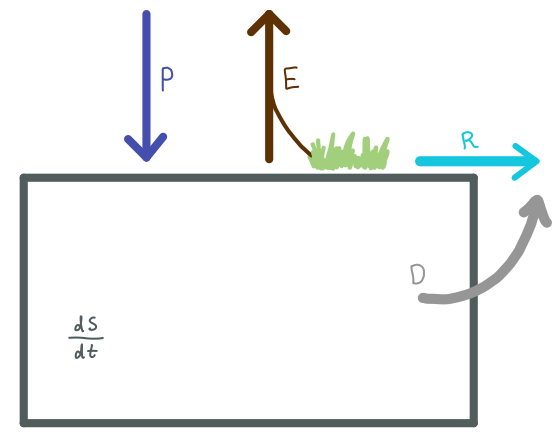

## Idealized Surface Soil Moisture Bucket Model or SWAP (Soil, Water, Atmosphere and Plant) Model
Developed as coursework

### Model Sketch

### Governing Equation

In imagining the regions soil moisture as a large bucket, the governing equation can be simplified to: 

### $\frac{dS}{dt} = P - (\beta E_{pot})$

where $\frac{dS}{dt}$ is the change in surface soil water content (soil moisture in mm), P is precipitation (mm/month), $\beta$ is a scaling factor representing soil moisture content's impact on plant transpiration, $E_{pot}$ is potential evapotranspiration (mm/day converted to mm/month).

Precipitation is variable and pulled from an observational data product, CRU (more on that below). R and D are constants. 

Evapotranspiration is calculated and linked to soil mosture.  This is commonly done by calculating potential evapotranspiration ($E_{pot}$) scaled by a $\beta$ factor between the scenarios $\theta_{crit}$, when soil moisture content is high enough that it does not limit evapotranspiration, and $\theta_{wilt}$, when soil moisture is so low that evapotranspiration does not occur.

This model calculates evapotranspiration using a modified Thornthwaite equation as outlined in Chang et al., 2019. The python logic used to replicate that equation was also sourced from [University of Michigan Earth Surface Processes' bucket-hydrology repository on Github](https://github.com/umn-earth-surface/bucket-hydrology). Additional code to calculate photoperiod is from [Github user Antti Lipponen](https://gist.github.com/anttilipp/ed3ab35258c7636d87de6499475301ce).
